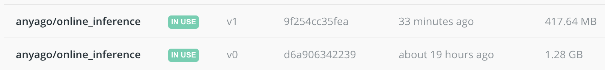

Обертка для модели из ml_project на основе fastapi и docker.

* Вытянуть образ из [хаба](https://hub.docker.com/):\
 ``docker pull anyago/online_inference:v1``
* Запустить модельку для запросов:\
 ``docker run -p 8000:80 anyago/online_inference:v1``
 
* Как работает
  1) Зайти на http://0.0.0.0:8000/docs и попробовать запустить примеры из predict
  2) Запустить пример из скрипта ``python request.py``, в ответ ожидается - индекс запроса: ответ (0 или 1)
  3) Запустить тесты ``pytest tests``

* Чтобы собрать образ контейнера \
``docker build -t anyago/online_inference:v1 .``

* Сжатие docker образа
\
Читала [тут](https://medium.com/swlh/alpine-slim-stretch-buster-jessie-bullseye-bookworm-what-are-the-differences-in-docker-62171ed4531d) и [тут](https://rodneyosodo.medium.com/minimizing-python-docker-images-cf99f4468d39).
Кажется, самое эффективное это выбрать подходящий базовый образ питона. Пробовала с alpine, но он слишком долго собирался. Плюс не храню кэш. В сжатом виде весит 130MB.
